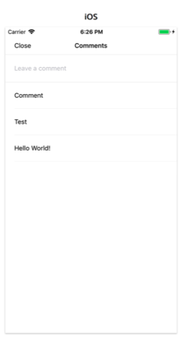
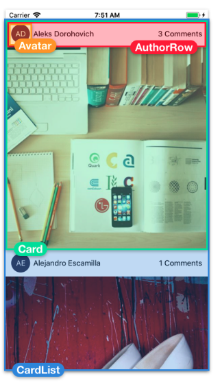

#RN_ImageFeed

### Screens
#### Feeds Screen
 

 #### Comments Screen
 

 ---

#### Breaking down Feed Screen
 

 ---

 ### Key Points
 + **ColorPropeType** is imported from react-native since colors in *react native* are strings, for validating contents of a value rather then just premitive types.
 + **PropTypes** package contains validators for premetive JavaScript types like numbers and strings.
   - *PropeTypes.shape()* to validate an object, passing keys of values we want to validate.
  - *PropeTypes.array()* to validate an array, padding the type of the element.
 ```javascript
 static propTypes = {
    items: PropTypes.arrayOf( 
        PropTypes.shape({
            id: PropTypes.number.isRequired,
            author: PropTypes.string.isRequired, 
        }),
    ).isRequired, };
 ```
   - If we want to reuse items at multiple places, define its type in separate file such as *ItemsPropType.js*
     - *ViewPropTypes.style* provides in-depth type-checking of each key and value for any style props.
 ```javascript
 static propTypes = {
    style: ViewPropTypes.style, 
};
 ```
 + We use *!!someText* i.e. Double negation that lets us make sure we're dealing with boolean value.
 + We can use predefined styles for setting absolute styles: 
   - *StyleSheet.absoluteFill* : This value can be passed directly to style prop of an element.
     - *...StyleSheet.absoluteFillObject*: This value is used for coping each of these properties into another style to overrride one or two properties but keep the rest.
 + **FlatList** components are used for rendering large wuantities of scrollable content.
   - *keyExtractor* to uniquely identify items
     - *renderItem* to render each new item from array.
 + **Destructuring** assignments can also be nested
 ```React
 renderItem = ({ item: { id, author } }) => {}
 ```
 + 


