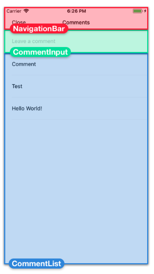

#RN_ImageFeed

### Screens
#### Feeds Screen
 

 #### Comments Screen
 

 ---

#### Breaking down Feed Screen
 

 ---

 #### Breaking down Comments Screen
 

 ---

 ### Key Points
 + **ColorPropeType** is imported from react-native since colors in *react native* are strings, for validating contents of a value rather then just premitive types.
 + **PropTypes** package contains validators for premetive JavaScript types like numbers and strings.
   - *PropeTypes.shape()* to validate an object, passing keys of values we want to validate.
   - *PropeTypes.array()* to validate an array, padding the type of the element.
 ```javascript
 static propTypes = {
    items: PropTypes.arrayOf( 
        PropTypes.shape({
            id: PropTypes.number.isRequired,
            author: PropTypes.string.isRequired, 
        }),
    ).isRequired, };
 ```
   - If we want to reuse items at multiple places, define its type in separate file such as *ItemsPropType.js*
   - *ViewPropTypes.style* provides in-depth type-checking of each key and value for any style props.
 ```javascript
 static propTypes = {
    style: ViewPropTypes.style, 
};
 ```
 + We use *!!someText* i.e. Double negation that lets us make sure we're dealing with boolean value.
 + We can use predefined styles for setting absolute styles: 
   - *StyleSheet.absoluteFill* : This value can be passed directly to style prop of an element.
   - *...StyleSheet.absoluteFillObject*: This value is used for coping each of these properties into another style to overrride one or two properties but keep the rest.
 + **FlatList** components are used for rendering large wuantities of scrollable content.
   - *keyExtractor* to uniquely identify items
   - *renderItem* to render each new item from array.
   - *extraData* to re-render based on change in item
 + **Destructuring** assignments can also be nested
 ```React
 renderItem = ({ item: { id, author } }) => {}
 ```
 + **shouldComponentUpdate** is used to improve performance of FlatList as it re-renders our cards while we scroll.
 ~~In our example, the only time data might change is if the number of comments to display changes. So added shouldComponentUpdate in Card.js to reduce re-renders.~~
 + Used **flex** to stretch elements.
 + Used **flexDirection**, **justifyContent** and **alignItems** for children layout.
 + Used **padding** and **margin** to define spacing between elements.
 + Used **position: 'absolute'** to stack elements on top of one another.
 + Created optimized styles with **StyleSheet.Create**.
 + **Modal** component used.
 + Computed property names
   - When defining object literals, we can dynamically compute property names by putting array brackets around the property name.
   ```javascript
   const name = 'foo';
   const obj = { [name]: 'bar'};
   console.log(obj.foo);  //=> 'bar'
   ```
   OR

   ```javascript
   const name = 'foo';
   const obj = {};
   obj[name] = 'bar';
   ```
 + **AsyncStorage** API to store small quantity of string data to device as a key-value pair.Complex object should be serialize to *JSON* first using **JSON.stringify**.
   - AsyncStorage.setItem(key, value) to store a value
   - AsyncStorage.getItem(key) to retrive a vaule.


